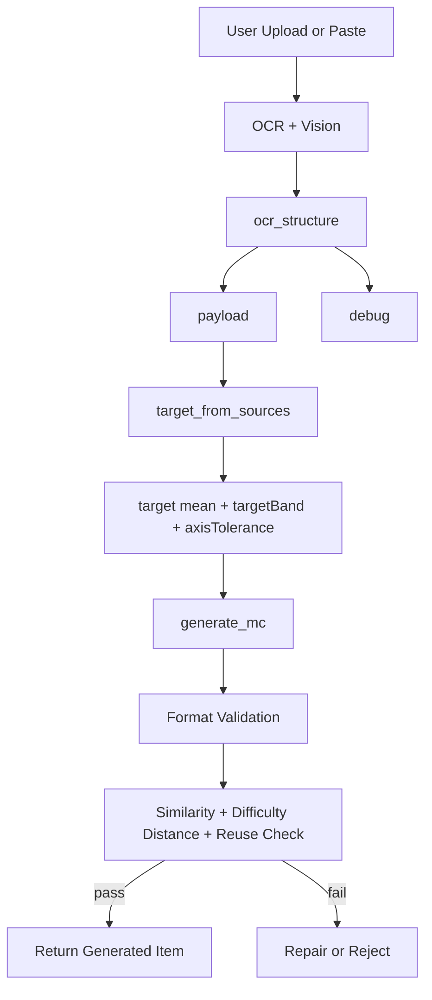

# Difficulty Evaluation-Guided Generation Engine

## 概要
本プロジェクトは、英語学習向け問題を **LLM生成 + 評価関数** で安定化する実験実装です。  
主眼は「問題生成」そのものではなく、**生成物の採否を評価で決めること**です。

- 固有試験ブランドには依存しない
- 画像入力（OCR/Vision）とテキスト入力の両方を扱う
- 難易度を L/S/A/R/D で定量化
- 類似度・形式・再利用語チェックで不適切生成を reject

---

## Local Dev（1コマンド起動）

```bash
npm install
npm run dev
```

- backend: `tsx watch` で自動リロード
- frontend: `next dev` で自動リロード
- ポート固定（デフォルト）:
  - frontend: `3000`
  - backend: `3001`（`PORT` で変更可）

---

## 現在の対応タスク
- `Guided Reading`（Passage + Inference Question + 4 Choices）

> v1は `Mode A (Free Domain)` を主軸にした **TOEFL-like 読解形式** に固定。
> `Context Completion` と `Mode B` は将来拡張。

---

## コア設計

### Evaluation-first
LLMは候補生成器。最終採用は評価側で決定。

1. 生成（Generate）
2. 検証（Format / Similarity / Difficulty / Reuse）
3. 採用 or Reject

### payload / debug 分離
`/ocr/structure` は以下を分離して返します。

- `payload`: 生成に必要な最小情報（本番利用）
- `debug`: 生OCR/整形結果などの観測情報（監査・開発用）

これにより「どの中間表現を正とするか」の混乱を避けます。

---

## Pipeline（現行）



---

## Execution Spec（Upload/Paste → Generation）

### 1. User Input
- `ocrFile`（画像）または `baselineSources`（テキスト）
- `taskType` は v1で `guided_reading` 固定

### 2. Frontend Image Preprocess
- 関数: `fileToResizedBase64(file, 1024)`
- 目的: 長辺 1024px に縮小して推論コストを削減
- API: `POST /vision/extract-slots`（best-effort）
- 使用項目: OCR補助（主生成はMCパース）

### 3. OCR
- 関数: `tesseract.recognize(...)`
- 正規化: `normalizeOcrText(...)`
- 結果テキストを次段の `/ocr/structure` へ渡す

### 4. Structure Build（`POST /ocr/structure`）

入力:
- `text`
- `preferredTaskType`
- `visionSlots`（任意）

内部処理（backend）:
- `parseMultipleChoice`（passage/question/choices/answer抽出）
- `classifyFormat`
- 必要時: heuristic parse fallback

出力は `payload` / `debug` を分離:

```json
{
  "payload": {
    "taskType": "guided_reading",
    "displayText": "Passage: ...",
    "textFeatures": {
      "wordCount": 136,
      "textLengthBucket": "medium",
      "cefr": "C1",
      "lexical": 0.34,
      "structural": 0.29
    }
  },
  "debug": {
    "rawOcrText": "...",
    "normalizedText": "..."
  }
}
```

Frontendで使うのは原則 `payload`:
- `payload.displayText` → 生成入力の基準テキスト
- `payload.sourceAnswerKey` → 再利用禁止用 `sourceAnswers`

### 5. Target Build（`POST /target/from-sources-mc`）

入力:
- `sourceTexts[]`

出力:
- `mean`, `std`
- `axisTolerance`
- `targetBand`（`min/max`）
- `effectiveTolerance`
- `stability`

`count=1` のときは点ではなく帯（range）重視で判定。

### 6. Generation（`POST /generate/fill-blank`）

入力:
- `sourceText`
- `target`（`L/S/A/R`）
- `sourceAnswers`（`sourceAnswerKey`）

内部処理:
- Step A: 空欄なし全文を生成（LLM）
- Step B: 空欄化語を選定（LLM, JSON）
- Step C: `buildBlankedCandidateFromFullText` で決定論的に空欄化
- Step D: 評価（format / similarity / jaccard / difficulty distance / reuse）

返却（成功時）:

```json
{
  "item": { "text": "... fa__ ...", "correct": "fame" },
  "answers": ["fame"],
  "similarity": 0.72,
  "jaccard": 0.22,
  "runId": "...",
  "sourceId": "...",
  "candidateId": "...",
  "debug": { "stage": "accepted" }
}
```

失敗時:
- `errorType`: `VALIDATION_FAILED` / `SIMILARITY_REJECTED` / `NO_CANDIDATE`
- `debug.stage`, `debug.llmLastValidationReason` で失敗段階を追跡

### 7. Audit（`POST /difficulty/overall`）
- 生成問題に対して `L/S/A/R/D` を再計測
- UIの `Difficulty Stability Console` に表示

### 8. Responsibility Split

AI利用:
- `/vision/extract-slots`
- `/ocr/structure` のOCR補正
- `/generate/fill-blank` の Step A / Step B

決定論（関数）:
- 正規化・抽出: `normalizePrefixUnderscorePatterns`, `extractBlankSlots`
- 空欄化: `buildBlankedCandidateFromFullText`
- 検証: `validateGenerated`
- 評価: similarity / jaccard / difficulty
- 再利用語reject: `sourceAnswers` 正規化比較

---

## Context Completion フロー（詳細）

### Step A
空欄なしの全文を生成（LLM）

### Step B
その全文から空欄にする語を選定（LLM, JSON）

### Step C
空欄化はコード側で決定論的に実施

- prefixあり/なしを保持
- blank長は実語長から算出

### Step D
評価関数で採否判定

- format
- similarity / jaccard
- difficulty distance
- source answer reuse

---

## Difficulty モデル

### 軸
- `L`: Lexical Complexity
- `S`: Structural Complexity
- `A`: Semantic Ambiguity
- `R`: Reasoning Depth

### 統合
`D = 0.20L + 0.20S + 0.30A + 0.30R`

### Target の扱い
`/target/from-sources` は以下を返却:

- `mean`
- `std`
- `axisTolerance`
- `targetBand(min/max)`
- `effectiveTolerance`
- `stability`

`count=1` の場合は点推定ではなく **帯（range）重視** で判定します。

---

## 主な API

### 入力解析
- `POST /ocr/extract` 画像OCR
- `POST /vision/extract-slots` 画像から slot 構造抽出
- `POST /ocr/structure` payload/debug 分離構造化

### ターゲット計算
- `POST /target/from-sources`（Context Completion）
- `POST /target/from-sources-mc`（Guided Reading）

### 生成
- `POST /generate/fill-blank`
- `POST /generate/mc`

### 評価
- `POST /difficulty/overall`
- `GET /difficulty/weights`

---

## 主要レスポンス例

### `/ocr/structure`（抜粋）
```json
{
  "payload": {
    "taskType": "context_completion",
    "format": "prefix_blank",
    "displayText": "... fa__ ...",
    "sourceAnswerKey": ["fail"],
    "slotCount": 1,
    "slots": [{ "prefix": "fa", "missingCount": 2, "slotConfidence": 0.82 }],
    "textFeatures": { "wordCount": 48, "textLengthBucket": "short", "cefr": "B2", "lexical": 0.31, "structural": 0.28 }
  },
  "debug": {
    "rawOcrText": "...",
    "aiNormalizedText": "...",
    "normalizedText": "..."
  }
}
```

### `/generate/fill-blank`（抜粋）
```json
{
  "item": { "text": "... fa__ ...", "correct": "fame" },
  "answers": ["fame"],
  "similarity": 0.72,
  "jaccard": 0.22,
  "runId": "...",
  "sourceId": "...",
  "candidateId": "...",
  "debug": { "stage": "accepted" }
}
```

失敗時は:

```json
{
  "errorType": "VALIDATION_FAILED",
  "debug": {
    "stage": "validation_failed",
    "llmLastValidationReason": "Expected exactly 1 blank."
  }
}
```

---

## フロント実装方針（現行）

- 上段: 学習者向け操作（入力・生成・回答）
- 下段: `Difficulty Stability Console`（監査）

Console では以下を表示:
- Compliance
- Target D / Current D / Distance
- Target Range（L/S/A/R）
- Axis Table
- Similarity（必要時）
- `debug.stage`, `runId`, `sourceId`

---

## 制約（v1）

- OCR品質が極端に低い画像では slot抽出が不安定
- `Context Completion` は現在 1〜2 blanks を優先
- `Mode B` は未実装（READMEの将来計画）

---

## 技術スタック

### Backend
- Node.js / TypeScript / Express
- Embedding Provider（Dummy / Gemini）
- Gemini Text Generation Provider

### Frontend
- Next.js 14
- React + useState（軽量構成）

### Infra（想定）
- DigitalOcean App Platform
- Managed DB / Vector拡張（将来）

---

## 目的の再定義

本プロジェクトは「教育アプリUI」よりも、

**Evaluation-Guided Generation（評価設計駆動の生成制御）**

を実証するためのエンジンです。
