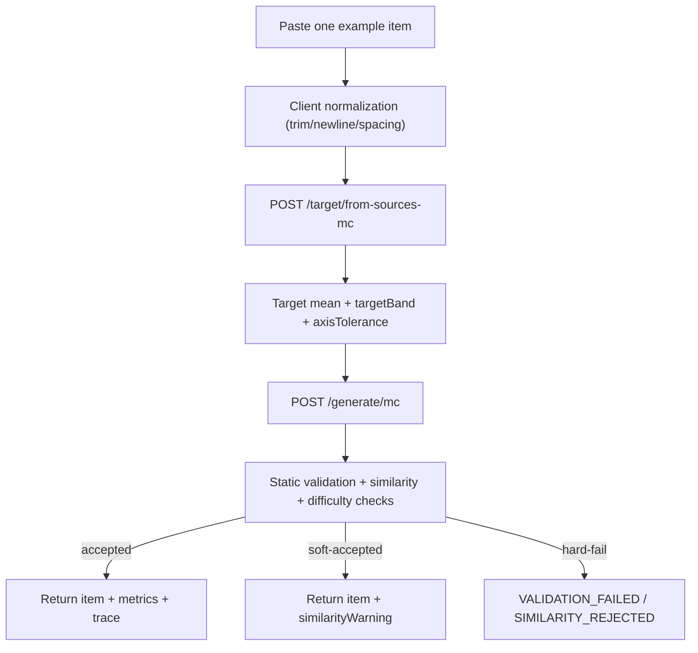

# Difficulty Evaluation-Guided Generation Engine

## Overview
This project is a **Guided Reading item generation engine** for English learning.
The goal is not raw content generation; it is **evaluation-driven control**:

- Generate `Passage + Inference Question + 4 choices`
- Measure difficulty with `L / S / A / R / D`
- Enforce format and similarity guards
- Expose run metadata (`stage`, `runId`, `sourceId`) for auditability

v1 is intentionally narrowed to one flow so it can be demonstrated reliably.

---

## v1 Scope

### Included
- Guided Reading (single item)
- Mode A only (topic can change)
- Text input only (paste one example item)
- Generate / Regenerate workflow
- Inference style selector (`fact_based` / `intent_based` / `emotional`)

### Out of scope (v2+)
- Context Completion (fill-blank)
- Mode B (concept preservation)
- OCR / image upload path in UI

---

## Local Dev

```bash
npm install
npm run dev
```

- Frontend: `http://localhost:3000`
- Backend: `http://localhost:3001`

### v1 Typecheck

```bash
npm run typecheck:v1
```

This checks only submission-critical paths.

---

## DigitalOcean App Platform (Backend)

Set **Source directory** to:

```text
backend
```

Use:

- Build command

```bash
npm ci && npm run build
```

- Run command

```bash
npm start
```

Backend production scripts:
- `npm run build` → `tsc -p tsconfig.v1.json`
- `npm start` → `node dist/backend/src/index.js`

Recommended backend env vars:

```text
GRADIENT_API_KEY=...
GRADIENT_MODEL=meta-llama/Meta-Llama-3.1-8B-Instruct
# optional
GRADIENT_BASE_URL=https://api.gradient.ai/v1
```

Health check:

```text
GET /health
```

---

## DigitalOcean App Platform (Frontend Static Site)

Set **Source directory** to:

```text
frontend
```

Use:

- Build command

```bash
npm ci && npm run build
```

- Output directory

```text
out
```

Required env var (build-time):

```text
NEXT_PUBLIC_API_BASE=<backend public base URL>
```

If backend is mounted under an app path prefix, include it in `NEXT_PUBLIC_API_BASE`.
Example:

```text
NEXT_PUBLIC_API_BASE=https://deterministic-ai-control-engine-dkcf4.ondigitalocean.app/deterministic-ai-control-engine
```

Current frontend URL example:

```text
https://deterministic-ai-control-engine-dkcf4.ondigitalocean.app/
```

---

## UI Semantics

The top controls are:

- `Generate`
  - Runs lightweight client-side normalization + target build when needed
  - If source text changed (or target missing), target is recalculated automatically
  - Then generates one MC item
- `Regenerate`
  - Reuses the current target and regenerates a new candidate

This keeps first-run setup automatic while enabling rapid exploration.
For Guided Reading v1 demo flow, `/ocr/structure` is intentionally not called from the UI.

Input expectation (recommended):

```text
Passage:
...

Question:
...

Choices:
A) ...
B) ...
C) ...
D) ...

Answer: B
```

Parser also accepts numeric choices like `1 ... 2 ... 3 ... 4 ...`.

---

## Contract-First API

Single source of truth:
- `shared/api.ts`

Common contract is applied to:
- `POST /target/from-sources-mc`
- `POST /generate/mc`

Responses are discriminated unions:
- success: `{ ok: true, apiVersion: "v1", ... }`
- error: `{ ok: false, apiVersion: "v1", errorType, ... }`

---

## Pipeline (Current)



---

## Core Endpoints

## 1) Build target
`POST /target/from-sources-mc`

Request:
```json
{
  "sourceTexts": ["Passage: ... Question: ... Choices: ..."]
}
```

Success:
```json
{
  "ok": true,
  "apiVersion": "v1",
  "mean": { "L": 0.3, "S": 0.4, "A": 0.7, "R": 0.4 },
  "std": { "L": 0.0, "S": 0.0, "A": 0.0, "R": 0.0 },
  "axisTolerance": { "L": 0.12, "S": 0.12, "A": 0.12, "R": 0.12 },
  "targetBand": {
    "min": { "L": 0.18, "S": 0.28, "A": 0.58, "R": 0.28 },
    "max": { "L": 0.42, "S": 0.52, "A": 0.82, "R": 0.52 }
  },
  "count": 1,
  "stability": "Low",
  "effectiveTolerance": 0.12
}
```

## 2) Generate item
`POST /generate/mc`

Request:
```json
{
  "sourceText": "Passage: ...",
  "target": { "L": 0.3, "S": 0.4, "A": 0.7, "R": 0.4 },
  "mode": "A",
  "inferenceStyle": "fact_based"
}
```

Success:
```json
{
  "ok": true,
  "apiVersion": "v1",
  "item": {
    "passage": "...",
    "question": "...",
    "choices": ["...", "...", "...", "..."],
    "correctIndex": 1
  },
  "format": "multiple_choice",
  "similarity": 0.53,
  "jaccard": 0.23,
  "similarityRange": { "min": 0.4, "max": 0.85, "maxJaccard": 0.75 },
  "similarityBreakdown": {
    "passage": 0.49,
    "question": 0.53,
    "correctChoice": 0.58,
    "distractors": 0.56,
    "choices": 0.57
  },
  "mode": "A",
  "choiceStructure": {
    "correctMeanSim": 0.60,
    "distractorMeanSim": 0.69,
    "distractorVariance": 0.01,
    "isolationIndex": -0.09
  },
  "runId": "...",
  "sourceId": "...",
  "candidateId": "...",
  "debug": { "stage": "accepted" }
}
```

Error:
```json
{
  "ok": false,
  "apiVersion": "v1",
  "error": "Generated problem too similar to source. Please try again.",
  "errorType": "VALIDATION_FAILED",
  "reason": "Question is not inference-oriented.",
  "runId": "...",
  "sourceId": "...",
  "debug": {
    "stage": "validation_failed",
    "llmLastValidationReason": "Question is not inference-oriented."
  }
}
```

---

## Validation and Acceptance Strategy (v1)

Hard requirements:
- MC format is valid
- Exactly 4 choices
- Exactly 1 correct answer
- Question does not embed choices
- Choice-level hygiene (duplicates / meta-choice bans)

Quality checks:
- Inference-oriented question style
- Similarity window and lexical overlap controls
- Difficulty distance against target profile

Repair behavior:
- If model returns more than 4 choices, engine trims to 4 while preserving the correct option.
- If strict checks fail but base MC structure is usable, engine may soft-accept and return `similarityWarning`.

To keep UX smooth, v1 also allows **soft-accept** in constrained cases:
- returns success with `similarityWarning`
- keeps stage trace for auditability

`errorType` values in v1:
- `BAD_REQUEST`
- `VALIDATION_FAILED`
- `SIMILARITY_REJECTED`

`debug.stage` values:
- `source_received`
- `source_parsed`
- `passage_generated`
- `candidate_generated`
- `validation_failed`
- `similarity_rejected`
- `accepted`

---

## Difficulty Model

Axes:
- `L`: lexical complexity
- `S`: structural complexity
- `A`: semantic ambiguity (correct vs distractors)
- `R`: reasoning depth

Composite score:
- `D = 0.20L + 0.20S + 0.30A + 0.30R`

For `count=1`, range-based interpretation (`targetBand`) is prioritized over point precision.

---

## Notes

- `GET /favicon.ico 404` from frontend dev server is non-blocking.
- If frontend shows `ERR_CONNECTION_REFUSED` for `:3001`, backend is not running.
- If you see `Failed to parse multiple-choice input`, ensure one full item is pasted (passage + one question + one 4-choice set).
- If `GET /difficulty/weights` returns `404` in production, `NEXT_PUBLIC_API_BASE` is likely pointing to the wrong base path (missing backend prefix).
- `NEXT_PUBLIC_API_BASE` is embedded at build time for static export; changing it requires redeploy.

---

## Tech Stack

- Backend: Node.js, TypeScript, Express
- Frontend: Next.js 14, React
- Generation: DigitalOcean Gradient Serverless Inference
- Embeddings/Evaluation: Gemini embeddings (or dummy embeddings for local fallback)

Design note:

> Generation runs on DigitalOcean Gradient Serverless Inference.  
> Embeddings remain on Gemini because Serverless inference currently exposes generation models only; the embedding provider is abstracted and swappable.

---

## Project Positioning

This repository demonstrates an **evaluation-controlled generation engine**,
not a full consumer test-prep app.
